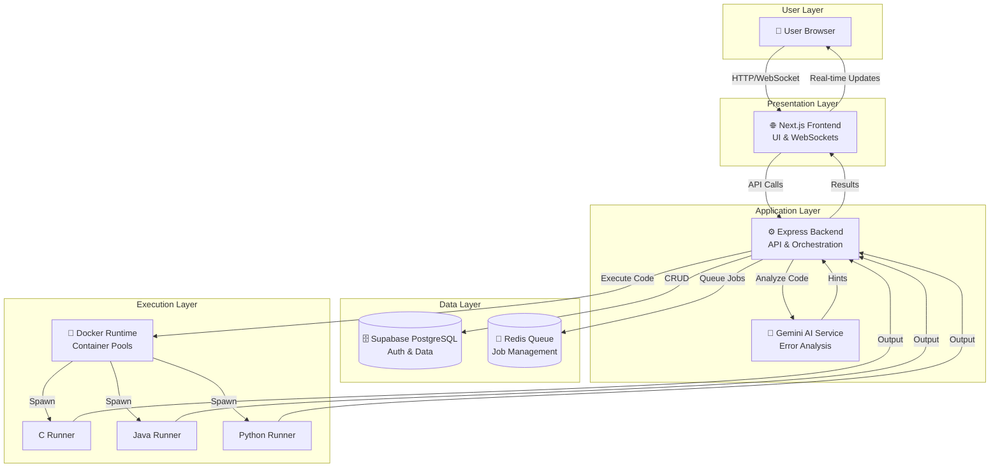

# 🚀 Code Execution Platform


Welcome to the **Code Execution Platform**, a cutting-edge system designed for secure, real-time coding environments. Built for educators, students, and developers, it offers isolated code execution with AI-powered insights, making learning and testing code safer and smarter than ever.

---

## 🚀 What Makes CodeGuard Stand Out

### Execution Engine
- **Instant Runs**: Our pre-heated Docker pools mean no waiting – code executes the moment you hit run.
- **Fort Knox Security**: Every snippet runs in its own Alpine Linux container with strict resource limits, blocking any malicious attempts.
- **Rich Editing Experience**: Powered by Monaco Editor, with a sleek glassmorphism interface that adapts to your coding style.
- **Live Terminal**: Experience real-time output streaming over WebSockets, complete with safeguards against infinite loops and interactive prompts.

### For Learners
- **Smart Retries**: Failed attempts? CodeGuard handles reattempts automatically, with faculty approval workflows built-in.
- **Mobile-Friendly**: Navigate subjects and submissions effortlessly on any device, thanks to adaptive layouts.
- **Progress Tracking**: Get immediate insights into your code's performance, with detailed breakdowns of test cases and metrics.

### AI-Powered Insights
- **Intelligent Assistance**: Gemini AI doesn't just run code – it explains errors, suggests fixes, and provides contextual hints to accelerate learning.

### Sleek User Interface
- **Modern Aesthetics**: Glassmorphism meets fluid animations for a premium feel that doesn't sacrifice functionality.
- **Responsive Design**: From desktops to phones, CodeGuard scales beautifully with hybrid card/table views.
- **Fast Loading**: Skeleton loaders ensure the UI feels instant, even during heavy computations.

### Admin Tools
- **Comprehensive Dashboards**: Faculty and admins get dedicated views for overseeing classes, resources, and analytics.
- **Deep Analytics**: Dive into submission histories, grading trends, and performance data.
- **Easy Imports**: Bulk upload users via CSV or Excel with simple drag-and-drop.

---

### Core Execution
- **⚡ Zero-Latency Execution** – "Pre-warmed" container pools ensure code runs instantly without cold start delays.
- **🔒 Secure Sandboxing** – All code executes in isolated, resource-constrained Docker containers (Alpine Linux) to prevent malicious activity.
- **📝 Advanced Editor** – Monaco-based rich text editor with glassmorphism UI, smart language switching, and smooth resizing capabilities.
- **📶 Interactive Terminal** – WebSocket-based terminal facilitating real-time partial output streaming, infinite loop protection, and interactive input.

### Student Experience
- **🔄 Smart Reattempt System** – Automated handling of practical reattempts with integrated approval workflow for failed submissions.
- **📱 Adaptive Navigation** – Mobile-optimized subject filtering and horizontal scroll views for efficient access on any device.
- **📈 Real-time Progress** – Instant feedback on submissions with detailed test case analysis and execution metrics.

### AI & Intelligence
- **🤖 Clinical AI Intelligence** – Integrated Gemini AI for smart error diagnostics, code explanation, and automated hints.

### User Experience
- **✨ Premium UI** – Modern glassmorphism design with fluid animations and responsive layouts.
- **📱 Fully Responsive** – Mobile-first design with card/table hybrid views that adapt to any screen size.
- **⏳ Skeleton Loaders** – High-fidelity skeleton components for instant page rendering without blocking loaders.

### Administration
- **👩‍🏫 Faculty & Admin Dashboards** – Specialized interfaces for managing classes, students, and system resources.
- **📊 Detailed Analytics** – Track submission history, performance metrics, and automated grading results.
- **📥 Bulk User Import** – Import users from CSV or Excel files with drag-and-drop support.

---

## 🏗️ Architecture Overview

CodeGuard follows a **microservices-inspired architecture** designed for scalability, security, and real-time performance. The system is divided into distinct layers, each handling specific responsibilities to ensure efficient code execution and user management.

### High-Level Components
- **Frontend Layer**: A modern Next.js application providing a responsive UI for students, faculty, and admins. It handles user authentication, code editing, and real-time interactions via WebSockets.
- **Backend Layer**: A Node.js/Express server that orchestrates API requests, manages job queues, and coordinates code execution. It integrates with external services like Supabase for data persistence and Gemini AI for intelligent code analysis.
- **Execution Layer**: Isolated Docker containers for secure code execution in multiple languages (C, Java, Python). Containers are pre-warmed in pools to eliminate latency.
- **Data Layer**: Supabase (PostgreSQL) with Row-Level Security (RLS) for multi-tenant data isolation.
- **Infrastructure Layer**: Redis for job queuing, Docker Compose for orchestration, and WebSockets for real-time communication.

### Data Flow
1. Users interact with the Next.js frontend, submitting code or managing assessments.
2. The backend receives requests, validates them, and queues execution jobs in Redis.
3. Jobs are processed by pulling pre-warmed Docker containers from pools.
4. Code runs in isolated environments, with output streamed back via WebSockets.
5. Results are stored in Supabase and analyzed by AI for feedback.
6. Real-time updates are pushed to the frontend for instant user feedback.



---

## 🧩 Tech Stack

| Domain | Technologies |
|:---|:---|
| **Frontend** | **Next.js 16**, React 19, TypeScript, Tailwind CSS, Framer Motion, ShadCN UI |
| **Backend** | **Node.js**, Express.js 5, WebSocket (ws), BullMQ, Redis, Zod |
| **Infrastructure** | **Docker**, Docker Compose, Supabase (PostgreSQL + Auth) |
| **AI** | **Google Gemini 1.5** (Flash model) for error analysis and coding assistance |
| **Runtimes** | Python 3.12, OpenJDK 21, GCC (C/C++) on Alpine Linux |

---

## 🗄️ Setting Up Your Database (Supabase)

CodeGuard's data backbone is a carefully crafted PostgreSQL setup, fortified with 44 Row-Level Security (RLS) policies to keep student, faculty, and admin data strictly separated.

1. **Find the Schema File**: Head over to [`supabase/migrations/20240101000000_init.sql`](supabase/migrations/20240101000000_init.sql) for the full schema.
2. **Apply It**:
   - Log into your Supabase dashboard and open the SQL Editor.
   - Paste the schema content and execute it.
3. **What's Inside**:
   - Core tables for users, practicals, submissions, test cases, and grades.
   - RLS ensures that students only see their own work, faculty manage their classes, and admins oversee everything.

---

## 🛠️ Quick Start with Docker Compose

The fastest path to seeing CodeGuard in action is via Docker Compose – it spins up everything you need in one go.

### What You'll Need
- Docker and Docker Compose installed.
- Your Supabase project ready with URL and keys.

### Step 1: Environment Config
Drop a `.env` file in the project root with these details:
```env
# App Basics
CORS_ORIGIN=http://localhost:3000
NEXT_PUBLIC_API_URL=http://localhost:5002

# Supabase Details
NEXT_PUBLIC_SUPABASE_URL=your_supabase_url
NEXT_PUBLIC_SUPABASE_ANON_KEY=your_supabase_anon_key
SUPABASE_SERVICE_ROLE_KEY=your_service_role_key
JWT_SECRET=your_secret_here

# AI Setup
AI_API_KEY=your_gemini_key
AI_PROVIDER=gemini
AI_MODEL=gemini-1.5-flash

# Infra
REDIS_URL=redis://redis:6379

# Limits
DOCKER_MEMORY_LIMIT=128m
DOCKER_CPU_LIMIT=0.5
DOCKER_POOL_SIZE_PYTHON=2
EXECUTION_TIMEOUT=15
```

### Step 2: Fire It Up
Run this command to build and launch:
```bash
docker-compose up --build
```
- Frontend pops up at http://localhost:3000
- Backend API at http://localhost:5002

Pro Tip: If you're new to Docker, this setup handles all the heavy lifting – no need to worry about dependencies!

---

## 💻 Developing Locally (Manual Setup)

Prefer to tinker with individual components? Here's how to run CodeGuard piece by piece for development.

### Backend First
1. Make sure Docker is up and Redis is running (usually on localhost:6379).
2. Jump into the `backend/` folder:
   ```bash
   cd backend
   npm install
   ```
3. Launch in dev mode for hot-reloading:
   ```bash
   npm run dev
   ```

### Frontend Next
1. Switch to `frontend/`:
   ```bash
   cd frontend
   npm install
   ```
2. Kick off Next.js:
   ```bash
   npm run dev
   ```

### Quality Checks
- Test everything: `npm test`
- Check code style: `npm run lint`

This setup gives you full control – perfect for debugging or adding features.

---


